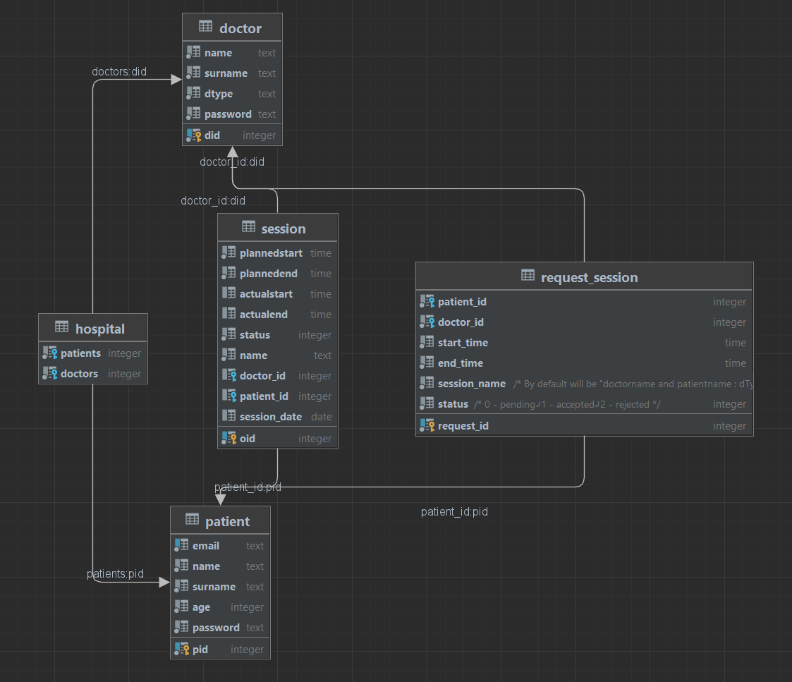

# Hospital System
## FIT CTU BIE-TJV 2022 semester project,
### by Nikita Matsnev

## 1.  Description
    
This is a project for BIE-TJV implemented by Nikita Matsnev in 2022 winter semester.
The domain is hospital where Patients with known email(unique), name and surname can have 
Session at some specific time
and there is a Doctor at each session, and we know about him/her his/her name, surname and
specialization. we can determine actual time of Session after it is done, and we track it by its status 
and each patient has a medical records book where all the performed sessions are seen and also the information 
about receiving doctor. Doctor can see finished and upcoming Sessions. They can create Session slots.
There are several constraints such as Doctor cannot be at two Sessions at the same or overlapping time.
Patient cannot attend several Sessions at the same or overlapping time.
Patient can have many sessions with many doctors and doctors can have many sessions with different patients.
Patients and Doctors are assigned to the hospital. Doctors can treat patients within the hospital.

### 1.1. Server
Server will be implemented in Java Spring. I wil use `jdk18` and `Java 17`. Spring Web will be used
to provide RestAPI.

#### API Endpoints:
##### 1. Patients:
`GET /patients/{id}` - gets patient by id \
`PUT /patients/{id}` - updates patient with id \
`DELETE /patients/{id}` - deletes patient with id \
`POST /patients/register` - registers patient with id and given body \
`POST /patients/login` - check if patient with email exists and password matches
##### 2. Doctors:
`GET /doctors/{id}` - gets doctor by id \
`PUT /doctors/{id}` - updates doctor with id \
`DELETE /doctors/{id}` - deletes doctor with id \
`POST /doctors/register` - registers doctor with id and given body \
`POST /doctors/login` - check if doctor with email exists and password matches
##### 3. Sessions:
`GET /session/{id}` - gets session by id \
`PUT /session/{id}` - updates session with id \
`DELETE /session/{id}` - deletes session with id \
`POST /session/create` - creates session with id and given body \
`POST /session/doctor/{id}` - gives this doctor sessions \
`POST /session/patient/{id}` - gives this patient sessions
### 1.2. Web client
I am planning on using the Reactive Stack and Spring WebFlux, and I use it. I also use Thymeleaf for templating. And Seneca's letters for contemplating:D.

### 1.3. Database
PostgresSQL will be used, I have already created a schema. It has two many-to-many relations.

## 2. Build
* [Official Gradle documentation](https://docs.gradle.org)
## 3. Run
* [Official Gradle documentation](https://docs.gradle.org)
## 4. Test
junit tests